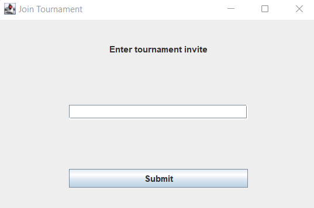

# Tournament Bracket Manager

## The Objective
Our main goal was to be able to create a system where someone could manage how a tournament has happening in real time
by allowing them to use this program to allow tournament officials and participants alike to see and manage how the
tournament is progressing. We wanted to be able to allow the tournament creator to be able to assign different roles as
a result, to match how in real life, there are different roles that people play in a tournament. Thus, we have defined
three different roles in a tournament:
1. The Tournament Creator - which we call the "Overseer". An overseer creates the tournament, and is able to start
and end the tournament, and is able to assign referees to each game to officiate the game. They may themselves officiate
a game if they wish.
2. The Tournament Referees - each called an "Observer". An observer is able to officiate a game that they have been
assigned to by the overseer. By "officiate", we mean that they are able to update the score of the game, declare a
winner, and advance a team to the next round. 
3. The Players in a Tournament - each called a "Player". The player is able to join a tournament, and create a team,
or join a team that has already been created. They are able to see the bracket of the tournament, and see the scores of
the games that they have played in. 

By segregating what permissions each of these different actors have in our program, we can ensure that the tournament
bracket manager is able to be used in a variety of different ways, and that it can be used in a way that is most
realistic.

### Program Specification
1.  __A user may create a new tournament__; this user has the responsibility of running
    the tournament. Once they have created and launched the tournament, they may invite other
    players/teams to the tournament, assign them different roles with varying access and
    privileges. This user running the tournament can assign points to each match and run the
    tournament and advance the rounds at their convenience. Once the user wishes to conclude
    the tournament, they may choose to do so.

2. __A user may wish to join a pre-existing tournament via an invite link__ from the creator of the
tournament - and the invite link establishes their access level to the bracket and their privileges
in tournament. Should they join in a playing capacity, they can join a team in the tournament or
create their own and advance through the tournament. If they join in an officiating role, they
help run the tournament by advancing rounds of the tournament and dealing with updates to
the game.

## Features Implemented

* Logging in and creating an account (By Amy)
* Starting and ending a tournament (By David)
* Creating a new tournament (By Samuel)
* Joining a tournament and being assigned a role, or rejoining an existing tournament (By Nicholas)
* Creating a team (By Kelly)
* Joining a team (By Hanli)
* Adding referees to a game (By Nicholas)
* Adding/removing points to a team, declaring a winner of a game, advancing a team to the next round when
running the tournament (By Aditya)

## How To Use
### Running the Project
Run the program through the TournamentSimulator.java file. As well, please 
make sure to change the build settings from Gradle to IntelliJ IDEA to use the program. Go to file -> settings -> build, 
execution, development -> build tools -> gradle. Change the build and run to IntelliJ IDEA, like
so:

This piazza post details how we do it: https://piazza.com/class/l5v1b8gfz6b60m/post/473

## Opening The Project
After running the project, the first things that should come up is the hope screen, where you can either login or 
create an account.

## Navigating Options
After creating an account and/or logging in, you will be directed to an options screen where you can do one of three 
things: create a tournament bracket, join a new tournament bracket, or join an existing tournament bracket, you had
joined previously. You may also choose to log out at this point.

## Creating a Tournament
Suppose the first thing we want to do is create a new tournament. This can be done by clicking the "Create a New Bracket",
and filling out information on the new screen. Note that by creating a new tournament, you are automatically assigned
the role of the "Overseer" of the tournament. This means that you have the most privileges in the tournament.

## Joining a New Tournament
Suppose we want to join a new tournament. We can do this by clicking the "Join a New Bracket" button, and entering
in an invite link. The invite link given to you defines the role you have in the tournament. 

## Joining an Existing Tournament
Suppose we want to join an existing tournament. We can do this by clicking the "Join an Existing Bracket" button, and
choosing from a dropdown menu of the tournaments we have joined previously. The dropdown menu will only show the
ID of the tournament - so make sure to take note of that!

## Viewing the Tournament
Now you have successfully joined a tournament! You will be brought to the tournament screen, where you can see the
main bracket. You can also see the scores of the games you have played in, and the teams you are in, as well as the 
observer/referee for the game you are in.

## Joining and Creating Teams
To join or create a team, you have to be a player. You can do this by clicking the Teams tab, and then clicking either
the "Join Team" or "Create Team" button. You can see who is in which team on a table on the middle of the screen. 
When you create a team, the "BlankTeam" label gets replace by your team name. 

## Assigning Observers to a Game
To assign an observer to a game, you have to be an overseer. Navigate to the Observers tab, and then select the game
and the observer you want to assign to the game. You can see who is assigned to which game on a table. 

## Starting and Ending a Tournament

To start a tournament, you have to be an overseer. Navigate to the Overseer tab, and then click the "Start Tournament"
or the "Declare Winner - End Tournament" button. Notice how in this tab, you can also find the invite links to join
the tournament, under the end tournament button. So if you want to invite someone to join your tournament, you can give 
them this link!

## Running a Tournament/Updating the Bracket

Suppose you want to add points, declare a winner, or advance a team in a game. Navigate to the Bracket tab, and click
on a game. On the resulting new window, you can do any of these things, only if you are the overseer of the tournament
or the observer assigned to the tournament.

Some rules that we have enforced in our program with regard to bracket operations:
1. You cannot add points to a game that has already been won.
2. You cannot declare a winner/advance a team of a game that has not been won.
3. Teams cannot have negative points, and their point total cannot exceed the win condition set at the creation of the
bracket. 

We enforce these because these are generally common sense rules that should be followed in a tournament.

## Going Back to the Options Screen
There is a "Return to Options" button on the bottom left of the screen, which will take you back to the options screen.
From there you may log out, or do any of the other things you can do on the options screen.

We hope you have fun using the program!
